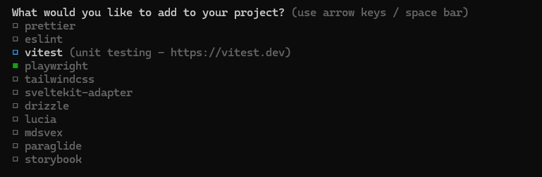
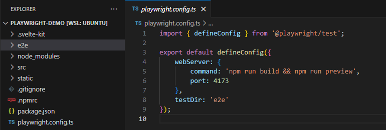
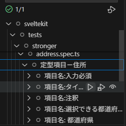
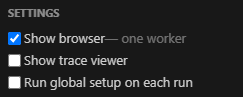
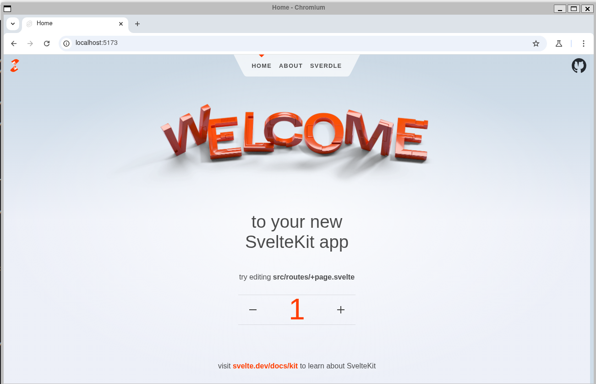
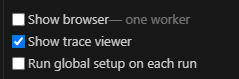
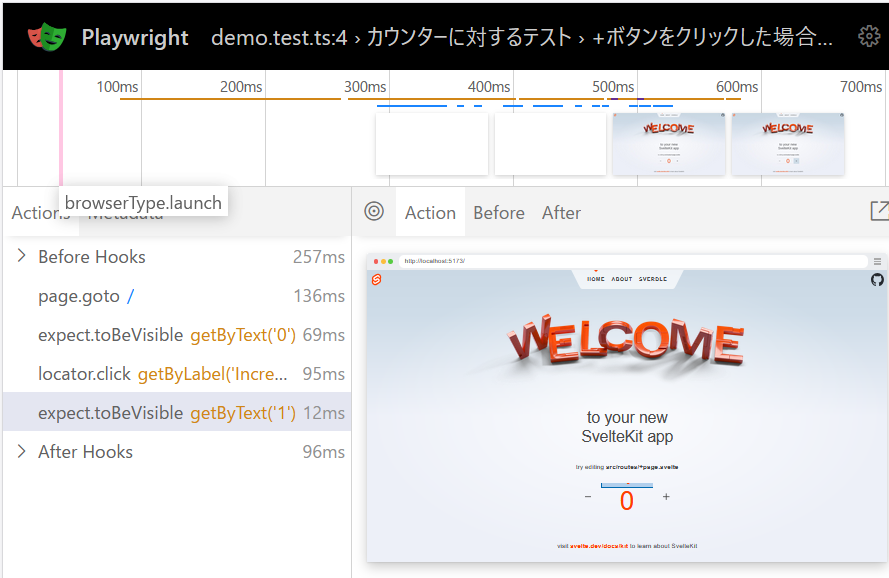
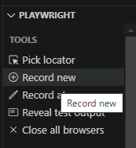
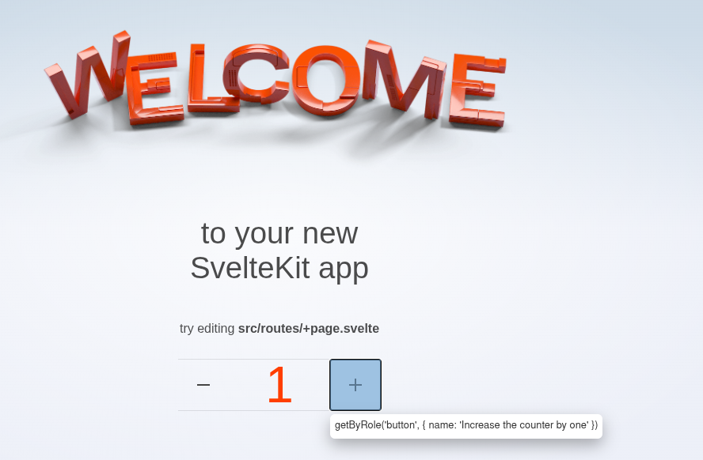

# playwrightでのE2Eテスト

## E2Eテストの概略
E2Eテストはシステム全体に対して行われるテスト。

そのシステムの利用者の目線に立って、ブラウザ上で入力してから実行結果が返ってくるまでの一連の流れを検証する。

実際にブラウザを起動してテストを実行するので、単体テストや結合テストに比べて実行時間がかかる。

## 環境の設定

### 新規でSveltekitプロジェクトを作成する場合

[Svelte CLI](https://hackmd.io/_uploads/BJQ7f3-Mel.png)を使用して

```bash 
npx sv create (プロジェクト名)
```

を実行。

以下の画面でplaywrightを選択することで、
playwrightがインストールされ、設定ファイル、テストフォルダが生成される。







### 既存のプロジェクトにplaywrightを導入したい場合

Svelte CLIで

```bash
npx sv add playwright
```
とすると、同様にplaywrightがインストールされる。

参考: https://svelte.jp/docs/cli/sv-add

## 設定ファイル(playwright.config.ts)

各設定内容は[ドキュメント](https://playwright.dev/docs/test-configuration)を参照

- testDir
  - e2eテストに使用するテストフォルダを指定(例: tests, e2e)
- webServer
  - テスト前に実装するwebサーバーの設定
  - `reuseExistingServer: !process.env.CI`としてローカルでは既に立ち上げたサーバーが存在する場合はそのサーバーを使用するようにする。
  
  
  


## Playwrightが提供するAPI
参考: [Playwrightが提供するAPI一覧](https://playwright.dev/docs/api/class-test)

### ロケーター

テスト内で捜査対象の画面要素を指定する

| メソッド名                          | 説明                                               | 使用例 |
|-----------------------------------|----------------------------------------------------|--------|
| `page.locator(selector)`         | CSS セレクタなどで要素を取得                      | `page.locator('text=Submit')` |
| `locator.getByText(text)`        | 指定したテキストを含む要素を取得                  | `locator.getByText('ログイン')` |
| `locator.getByRole(role, options)` | ロールとラベル名で要素を取得                      | `locator.getByRole('button', { name: '保存' })` |
| `locator.nth(index)`             | インデックスで要素を指定                          | `locator.nth(1)` |
| `locator.first()`                | 最初に一致した要素を取得                          | `locator.first()` |
| `locator.last()`                 | 最後に一致した要素を取得                          | `locator.last()` |
| `locator.filter(options)`       | テキストなどの条件で要素を絞り込み                | `locator.filter({ hasText: '削除' })` |
| `locator.locator(childSelector)`| 子要素のロケーターを取得                          | `locator.locator('span')` |

### アサーション

テスト内で期待される状態と実際の状態を比較/検証する。

- アサーションの例

| アサーション                              | 説明                  |
| ---------------------------------- | ------------------- |
| `toBeVisible()`                    | 要素が表示されているか         |
| `toBeHidden()`                     | 非表示か                |
| `toHaveText(text)`                 | テキスト内容が一致するか        |
| `toHaveValue(value)`               | input の値が一致するか      |
| `toHaveAttribute(name, value)`     | 属性の値が一致するか          |
| `toHaveClass(className)`           | class 名が一致するか       |
| `toBeEnabled()` / `toBeDisabled()` | 有効／無効か              |
| `toBeChecked()`                    | チェックボックスがチェックされているか |

- 例1: (`/user/home`に遷移していることを確認)

```
    await page.goto('/login');
    await page.locator('#userEmailTextbox').fill('hoge@example.com');
    await page.locator('#userPasswordTextbox').fill('00001111aa');
    await page.locator('button[type="submit"]').click();

    await expect(page).toHaveURL('/user/home');
```

- 例2: (エラーメッセージが表示されていることを確認)

```
  await page.locator('#item-title').fill('');
  await page.locator('#submit-update').click();
  await expect(
    page.locator('div.error-msg', { hasText: 'タイトルは入力必須です。' })
      ).toBeVisible();
    });
```


### フック 

`beforeAll`, `beforeEach`, `afterEach`, `afterAll`


| フック名       | 実行タイミング                           | 実行回数                | 主な用途例                                     |
|----------------|------------------------------------------|--------------------------|------------------------------------------------|
| `beforeAll`    | 各テストスイート（ファイルやdescribe）開始前 | スイートごとに1回         | データベース接続の初期化、共通データの作成など  |
| `beforeEach`   | 各 `test()` の直前                        | 各テストごとに1回         | ページ初期化、DBの初期状態リセットなど         |
| `afterEach`    | 各 `test()` の直後                        | 各テストごとに1回         | データのクリーンアップ、ログ保存など           |
| `afterAll`     | 各テストスイートのすべてのテスト終了後      | スイートごとに1回         | DB切断、リソース解放、スクリーンショットまとめなど |

- 実行順

 ```mermaid
sequenceDiagram
    autonumber
    participant Suite as テストスイート

    Note over Suite: テストスイート開始
    Suite->>Suite: beforeAll()

    loop 各テスト (テスト1, テスト2, …)
      Suite->>Suite: beforeEach()
      Suite->>Suite: test('テストX')
      Suite->>Suite: afterEach()
    end

    Suite->>Suite: afterAll()
    Note over Suite: テストスイート終了
```


- 使用例1(ログイン処理)

ログイン処理は各テストの前に毎回実行されるので、`beforeEach`を使用する

```ts
test.describe('フォーム作成: メールアドレスのテスト', () => {
  /**
   * このファイル内の各テストに共通する前処理をbeforeEachに記述する
   * テストの前に毎回実行される
   * ログイン->「新しいフォームを作成する」ボタンを押してメールアドレス入力画面(/user/new_form)に遷移
   */
  test.beforeEach(async ({ page }) => {
    await page.goto('/login');
    await page.locator('#userEmailTextbox').fill('hoge@example.com');
    await page.locator('#userPasswordTextbox').fill('00001111aa');
    await page.locator('button[type="submit"]').click();
    await page.locator('#create-new-form').click();
  });
 ```

- 使用例2(DBを使用したテスト)

テスト間での独立性を保つために、毎回DBをクリアする

```ts
test.describe('DBを使用したテスト', () => {
  // テストスイート開始前に一度だけ実行
  beforeAll(async () => {
    console.log('beforeAll: 全テーブルをクリアしてテストユーザーを作成');
    await cleanUpDatabase();
    await createTestUser();
  });

  // 各テスト前に、テストユーザーは残したまま他テーブルだけクリア
  beforeEach(async () => {
    console.log('beforeEach: 子テーブルをクリア');
    await cleanUpChildTables();
  });

  // 各テスト後に、同様に子テーブルをクリア
  afterEach(async () => {
    console.log('afterEach: 子テーブルをクリア');
    await cleanUpChildTables();
  });

  // 全テスト終了後に全データをクリアしてDB接続を切断
  afterAll(async () => {
    console.log('afterAll: 全テーブルをクリアして切断');
    await cleanUpDatabase();
    await disconnectDatabase();
  });
  
  test('テスト1', async ({ page }) => {
    ....
  }),
  
  test('テスト2', async ({ page }) => {
    ....
  }),
  ............
 });
```


### パラメータ化テスト

https://playwright.dev/docs/test-parameterize

複数の引数に対するテスト
playwrightでも実行できるが、時間が掛かるので単体テスト向き

- 例

```ts
    const heights = [100, 150, 200, 250, 300, 350, 400, 450, 500];
    for (const height of heights) {
      test(`高さを ${height}px にした場合`, async ({ page }) => {
        await page.locator('#comment-body').click();
        await page.locator('#comment-body').fill('');
        await page.locator('#comment-body').fill('テストコメント');

        await page.getByRole('combobox').selectOption(String(height));

        await page.getByRole('button', { name: '更新する' }).click();

        const commentBody = page.locator('.itemComment > div');
        const style = await commentBody.getAttribute('style');

        // 高さに関するスタイルが含まれているかチェック
        expect(style).toContain(`height: ${height}px;`);
      });
    }
```

//todo

## VSCodeの拡張機能

公式が提供している。
https://marketplace.visualstudio.com/items?itemName=ms-playwright.playwright

### 個別のテストに対するテスト実行



### Show browser
テスト実行時にブラウザを表示する。



### Show trace viewer





### Record new

「Record new」をクリックすると、ブラウザが立ち上げられる。ブラウザ上でボタンの操作等のアクションをすると、テストファイルに反映される。




- ブラウザ上で「+」ボタンをクリック


- 記録された操作
```
test('test', async ({ page }) => {
  await page.goto('http://localhost:5173/');
  await page.getByRole('button', { name: 'Increase the counter by one' }).click();
});
```


## CI環境でのplaywrightの実行

`.github/workflows`フォルダ内のymlファイルに記述する。


Playwrightのドキュメントで手順が紹介されている　https://playwright.dev/docs/ci-intro

APIキーなどが必要な場合は事前にSecretに登録しておく必要がある。
[GitHub Actions でのシークレットの使用](https://docs.github.com/ja/actions/security-for-github-actions/security-guides/using-secrets-in-github-actions)

パブリックリポジトリの場合は料金がかからないが、プライベートリポジトリの場合は一定のストレージ、時間を超えると料金がかかる

[GitHub Actions の課金について](https://docs.github.com/ja/billing/managing-billing-for-your-products/managing-billing-for-github-actions/about-billing-for-github-actions#github-actions-%E3%81%AE%E8%AA%B2%E9%87%91%E3%81%AB%E3%81%A4%E3%81%84%E3%81%A6)


