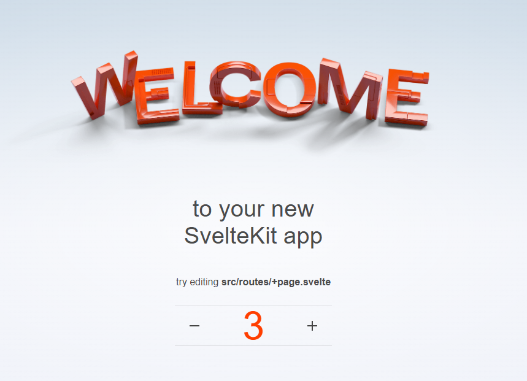

# リポジトリの説明

このリポジトリはSveltekitのデモアプリに対して、playwrightによるE2EテストとGithub Actionsのワークフローを実装したものです。

main ブランチには通常のデモアプリが、prisma ブランチには Prisma と MySQL を用いてカウンター機能を永続化したバージョンが含まれています。

  
E2Eテストの説明

  [E2Eテストの説明](./e2e.md)

